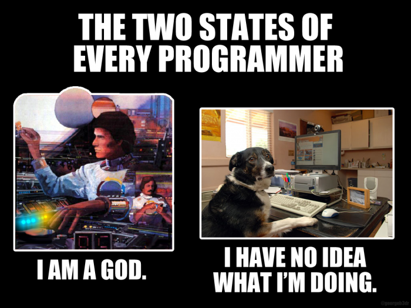

We've all been there. You write a piece of code, read through it, and think it's perfect because it makes sense to you at the time. Return to that same code a year later and it's **unrecognizable** 🙈

> This code I wrote is perfect! 😎
> <cite>— You, 1 year ago.</cite>

---

> WTF is this? 😡
> <cite>— You, looking at your code from 1 year ago.</cite>

The problem is that you're writing code for your current self. Instead, you need to write for your future self. Essentially just ask yourself this question: "Will the future me understand the intention of this block of code?"

Here's a few tips that I learned over many years of writing unreadable code.

## Do not try to impress yourself

I like writing clever code. It makes me feel smart. That is, until I look back at my clever code a year later and try to figure what it's doing and why I didn't just do it in a simpler and more standard way.

So if you want to do something impressive, write readable code. After all, you can go from feeling like a god to having no idea what you're doing in the same day.



## Use meaningful names

I have a hard time coming up with names for my variables, functions, modules, etc. There is even this popular quote:

> There are only two hard things in Computer Science: cache invalidation and naming things.
> <cite>— Phil Karlton</cite>

While naming is a skill to develop, I find that most just tend to either underthink or overthink it. Here are a few helpful suggestions I follow:

- Stay away from generic names like `container` or `data`.
- Use a prefix like `is` or `has` for booleans (even in typed languages).
- Use a prefix like `get` or `create` for functions to denote an action.
- Use a prefix like `min` or `total` for more descriptive numbers.
- Use proper pluralization when creating arrays like `users`.
- Avoid one letter variables like `e`. Just use `event` or `error`.
- Don't be afraid of long names with multiple words like `getTotalDaysSinceLastLogin`.

Most important of all: **reduce as much potential confusion as possible**.

## Separate your conditions

The core of many applications is the logic, which really just translates down to your `if` statements. The conditions for those statements can get pretty complex.

In this example, *how long* does it take you to understand the logic?

```js
if (users[0] && posts.find(post => post.userId === users[0].id)) {
  showUserPost();
}
```

Time is an important aspect here. Sure, I may be able to figure out this code snippet eventually, but if the entire codebase is written in this way then any future maintainer (including yourself) will be ripping their hair out trying to understand it.

You may be rushing to create a comment here, but instead let's just improve the code itself by moving the condition out to a meaningful variable.

```js
const isUserPostCreated = users[0] && posts.find(post => post.userId === users[0].id);

if (isUserPostCreated) {
  showUserPost();
}
```

And if we added another condition? Create another variable.

```js
const isUserPostCreated = users[0] && posts.find(post => post.userId === users[0].id)
const isReaderLoggedIn = getReaderFromDatabase().isLoggedIn();

if (isUserPostCreated && isReaderLoggedIn) {
  showUserPost();
}
```

Now when the future you looks at this code, you will be able to read the entire statement out loud and understand exactly what is going on.

## Create functions that have a single responsibility

I am guilty of creating `init()` functions that have hundreds of lines of code that do multiple things. It's easy to do, but unfortunately creates immovable code later.

A simple suggestion for this is to follow what is known as the **single responsibility principle**. This means that a function should only be responsible for one small piece of functionality.

Let's take an example of validating a username.

```js
function validateUsername(username) {
  // Invalid if username is over 20 characters.
  if (username.length > 20) {
    return false;
  }

  // Invalid if username has non-alphanumeric characters.
  if (/[^a-z0-9]/gi.test(username)) {
    return false;
  }

  // Invalid if user already exists in database.
  if (db.query('SELECT id FROM users WHERE username = ', username)) {
    return false;
  }

  // Otherwise valid!
  return true;
}
```

In a sense, this does follow the single responsibility principle because it is only validating a username. However, we are running multiple validations here including querying the database. We also can't be fully sure that it's working.

What we can do here is break up this function into other smaller functions.

```js
function validateUsernameLength(username) {
  return username.length <= 20;
}

function validateAlphanumeric(string) {
  return !/[^a-z0-9]/gi.test(string);
}

function checkUsernameExists(username) {
  return db.query('SELECT id FROM users WHERE username = ', username);
}

function validateUsername(username) {
  const isLengthValid = validateUsernameLength(username);
  const isAlphanumeric = validateAlphanumeric(username);
  const isUsernameTaken = checkUsernameExists(username);
  return isLengthValid && isAlphanumeric && isUsernameTaken;
}
```

Now these smaller functions are more easily changeable, movable, and testable.

---

## Your future you will thank you

And anyone else that may work on the code that you've written.

Did this article relate to your experiences? Do you have any other suggestions for readable code? I am constantly looking to improve myself, so please feel free to [tweet me](https://twitter.com/sunnysinghio) or [drop me an email](/contact).
