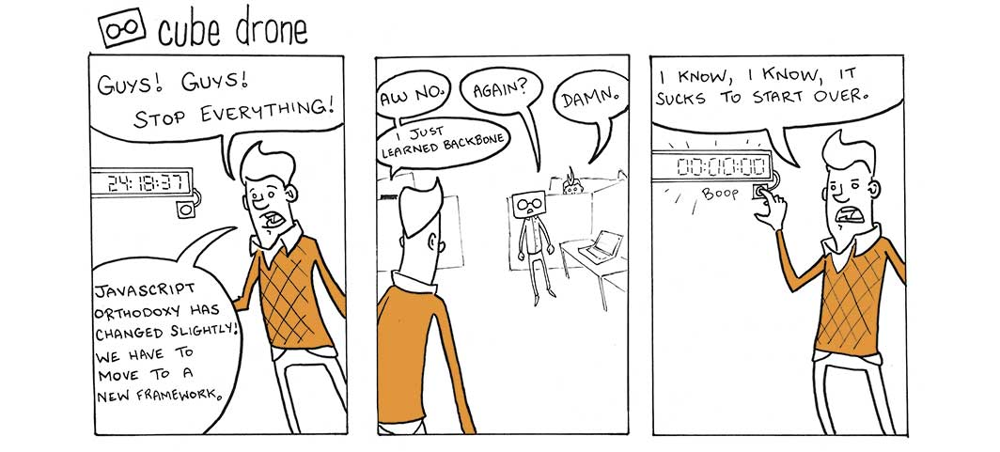

<Alert>
  This article was originally published to{' '}
  <AlertLink href="/news">the newsletter</AlertLink>.
</Alert>

There is a common joke in the JavaScript community that a new framework or library gets released every single day. True or not, it's funny because it definitely seems like that is the case. With so many new things to learn, how can you possibly keep up? Or should you?

## Learn patience, not a new framework ⏳

I love keeping up with the latest technologies. In fact, I built a site called [DevNews](https://devne.ws/) a few years ago in which I still use today for finding new tech and software related articles and products.

However, there is a big difference between reading up about a new framework versus actually _investing time_ to learning and potentially even migrating your current code over to it. A lot of the time, it's not worth it because that framework becomes obsolete or even non-existent in a few years.

I've been bitten by this problem many times in the past, and the best advice that I can give is to **simply be patient**.

For any big projects that you expect to stay around for at least 5 years, you probably want to observe a framework's community long enough before making the decision to learn and use it. Consider the time that you put in to learning a specific framework or tool to be an investment. That return on investment should be a positive one.

## The story of AngularJS and React ⚔️

Do you remember AngularJS? Many developers were using it around 5 years ago, and it was deemed the go-to framework for making a dynamic website or entire web app. It was even backed by Google, so what could go wrong?

Angular 2 was announced and it was completely different from the first version. In fact, backwards compatibility was not an available option early on. Thus the usage of React, a competing option from Facebook, grew.

I personally worked on an AngularJS project, but I never invested into it deeply. I was skeptical and continued to build my own projects the traditional way (a monolithic Laravel backend with a jQuery and Bootstrap frontend). Fast forward and I am now building multiple React apps.

I believe that this is the correct approach. Use the tools and technologies that work well for you until you know for sure that there is a better way.

> Cool cool... but how do I know when there is a better way?
>
> _— Avid blog reader_

Ah, I'm glad you asked. I did an entire podcast episode about this topic! While I talk about React specifically, the principles (community, efficiency, and longevity) apply to any framework or tool. Recommend you check it out 👇

- 🎧 [Listen to the podcast](http://sunny.link/pod62)
- 📺 [Watch the video](https://youtu.be/J1FO-2pRGDE)

In general, a large community size means more resources available to you for debugging issues and finding accompanying libraries. Even in the case of Angular, there are still tons of resources out there to continue maintaining those projects.
